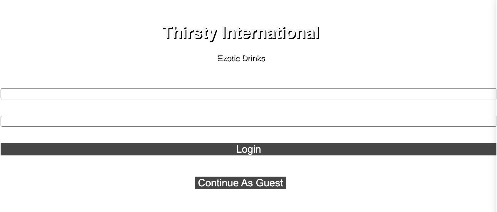

# Thirsty International

    
Description

    An E-Commerce Platform that lets you buy exotic drinks found all over the world.We are currently carrying drinks from imported from the Philippines, China, Korea, Japan, and Mexico.
    Users are able to buy items and guest are able to view our products and add them to cart but need to create an account to checkout.
    Users are able to see their order history in their profile page and see their cart from the cart section of the platform.

    
Tech Stack

    Javascript ||
    Express.js ||
    Node.js ||
    Git ||
    Webpack ||
    Babel ||
    React ||
    Redux ||
    Sequelize ||
    Bcrypt ||
    JSON Web Tokens ||
    Stripe

## Landing Page

## Products Page

## Users Page

## Profile Page

## Update Credentials Functionality

## Update Profile Functionality

## Cart Page

## Stripe Checkout Functionality

## Stripe Cart List Functionality

## Stripe Successful Transaction Page
